<div align=center style="margin-bottom:30px">
  <!--  -->
</div>

## 화장품 추천시스템 및 상담 챗봇

비대면 소통을 선호하는 MZ 세대를 위해 사용자 리뷰 기반으로 화장품을 추천하고 상담하는 <b>"챗봇 서비스"</b><br>
<br>
🧙‍♂️피부요정 뽀야미에게 맡겨만 주세요!
<br><br>

## 📌 프로젝트 정보
- 새싹 청년취업사관학교 용산2기 핀테크 특화 AI 엔지니어 양성과정
- 3차 자유 주제 프로젝트
- 기간: 2024.01.10 ~ 2024.01.17
- 주제: 기업용 LLM 챗봇 서비스
- 팀명: 뽀야미
- 서비스: [화장품 추천 상담챗봇 (링크)](https://llama.miner13.site/)
- PPT: [화장품 추천시스템 & 상담챗봇 상세 프레젠테이션 파일 (링크)](https://drive.google.com/file/d/1l3XX_9X5o1SL3v6130qw2LEzAg0NRLw8/view?usp=drive_link)

<br>


## 👑 프로젝트 내용

#### 1. 데이터 수집 및 전처리

1. 화장품 데이터 수집: 로션(192), 미스트-오일(48), 스킨-토너(321), 에센스(480), 크림(480) 총 1,521개 제품  
    - 제품 데이터
      - 수집 항목: 제품명, 제품 사진URL, 전성분
      - 수집 건수: 1,521
      - 출처: 올리브영, 글로우픽
    - 리뷰 데이터
      - 수집 항목: 닉네임, 제품명, 카테고리, 평점, 피부타입, 효과, 자극여부, 리뷰
      - 수집 건수: 22,860
      - 출처: 글로우픽
    - 성분 데이터:
      - 수집 항목: 성분코드, 성분명, 영문명, 기원 및 정의, 배합목적
      - 수집 건수: 19,563
      - 출처: 대한화장품협회 성분사전

2. LLM 학습용 데이터 수집: 네이버 지식인 API를 통해 “화장품 추천 관련 질문과 답변” 모음 총 1,250개 수집
    - 문답 데이터
      - 검색 키워드: ‘지성 추천’, ‘건성 추천’, ‘복합성 추천’, ‘화장품 트러블’, ‘화장품 부작용’ 
      - 수집 건수: 1,250 
      - 출처: 네이버 지식인
3. 화장품 데이터 전처리
    - 제품명 이외 정보 제거: ex) ~~[NEW/리뷰이벤트]~~ 에스트라 아토베리어365 크림 ~~80ml~~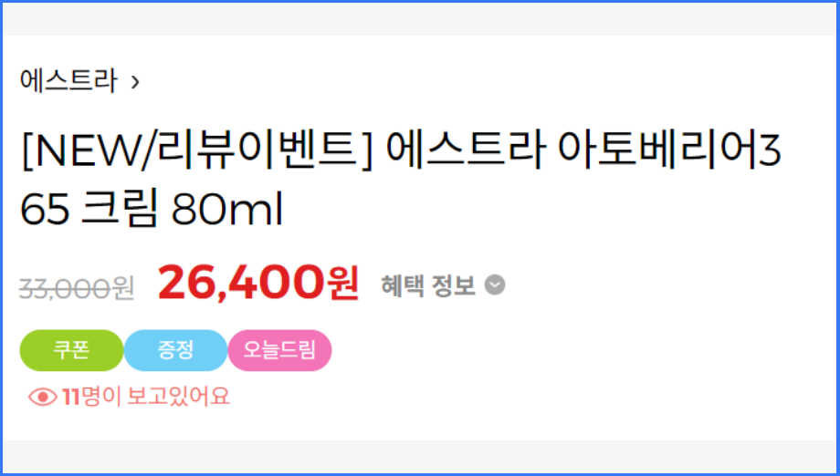
    - 숫자가 아닌 평점 정보 제거: ex) ~~5점 만점에~~ 5점
    - 중복 리뷰 제거: 동일한 리뷰를 삭제해 광고 대행으로 의심되는 리뷰 삭제
    - 리뷰가 많은 유저 제거(106개): 히스토그램 바탕으로 이상치 제거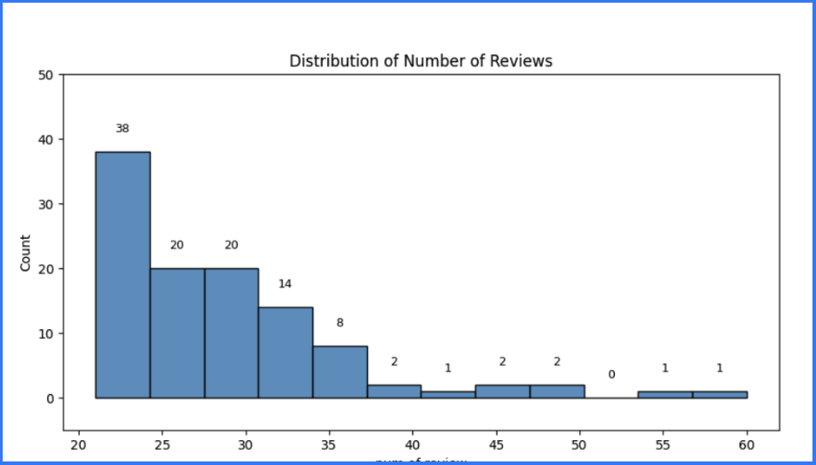
4. LLM 학습용 데이터 전처리: 채택된 답변 포함, 두 개 이상의 답변이 달린 질문
    - Fine-Tune: 질문/채택답변
    - DPO: 질문/채택답변/미채택답변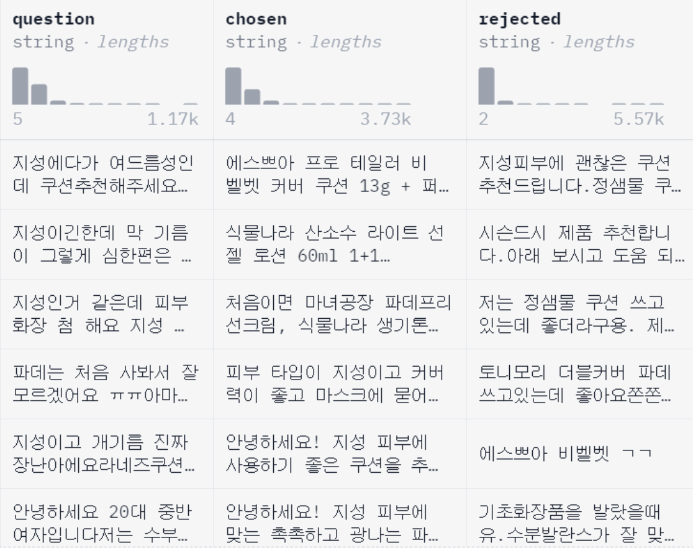
5. 데이터 분석: 고객에게 맞춤형 제품 추천을 통해 매출 상승 예상
    - 리뷰 워드클라우드 분석: 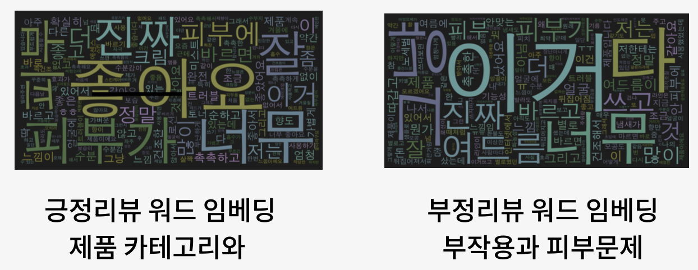
    - 유저별 평균 화장품 구매액: ₩ 53,000
<br>

#### 2. 사용자 기반 추천 시스템

1. 협업 필터링: 추천 시스템에 사용되는 기법으로, 사용자-아이템 간 상관관계 분석을 롱해 새로운 사용자-아이템 관계 발굴
    - 제품 리스트 입력 ->  User-item matrix 구축 -> User간 Cosine Similarity 계산 -> 아이템 평균평점 추론
    - 고객 선호도 바탕으로 “비슷한 취향을 가진 다른 유저가 구매한 제품” 추천
2. 추천 알고리즘
  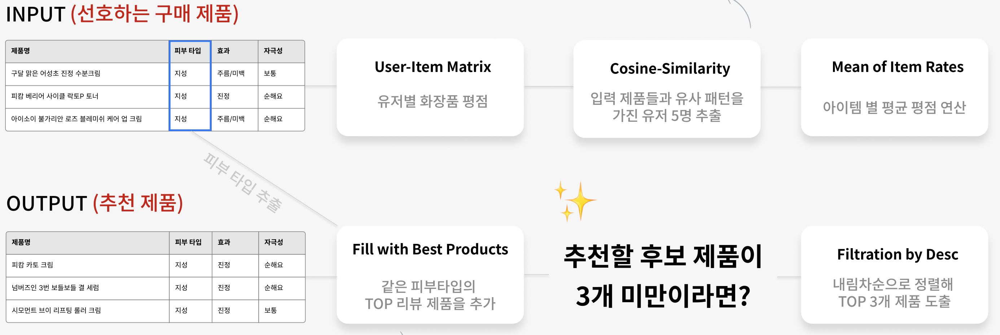
    - Input: 유저별 화장품 평점 -> 입력 제품들과 유사 패턴을 가진 유저 5명 추출 -> 제품별 평균 평점 연산
      - 유사도가 0인 유저 제거로 관련없는 유저의 제품 제외
    - Output: TOP 3개 제품 도출 -> 3개 미만일 경우 피부타입 기준으로 추천
      - 구매 제품 수가 적어도 “내 피부타입을 찾아” 리뷰 많은 제품을 추천
3. 추천 시스템 장점: “피부 타입 및 선호 제품 기반 개인 맞춤 추천”으로 사용자에게 정확하고 다양한 화장품 경험 제공
    - 개인화 된 추천 알고리즘: 사용자의 피부 타입과 선호 제품을 고려해 맞춤형 제품 추천
    - Cold Start 대응: 선호 제품 정보가 부족한 사용자에게도 피부타임 분석을 통해 유의미한 추천
    - 리뷰 기반 UX 향상: 화장품 리뷰 데이터를 기반으로 높은 정확성과 다양성으로 사용자 만족도 제고
<br>

#### 3. LLM Fine-tuning | RAG | DPO

1. Fine-tuning:
    - PEFT(Parameter Efficient Fine-Tuning)
    - Pretrained LLM의 일부 파라미터만을 파인튜닝 적은 컴퓨팅 자원으로도 LLM을 학습
    - LoRA(Low-Rank Adaptation)
      - 일부 파라미터의 가중치를 파인튜닝 하는 PEFT 방법론 
      - LLM의 가중치 행렬을 저순위 분해하여 작은 행렬로 변환 후 작은 행렬을 업데이트하여 파인튜닝
    - QLoRA(Quantized - Low-Rank Adaptation)
      - LoRA 기법에 양자화*(Quantized)개념을 더하는 파인튜닝 기법
      - 양자화(Model Quantization) : 파라미터의 비트 수를 줄여서 연산 효율을 높임으로써 컴퓨팅 파워가 약한 환경에서도 학습이 가능하게 함
2. RAG(Retrieval Augmented Generation):
    - “외부 소스에서 가져온 정보”로 생성 AI 모델의 정확성과 신뢰성을 향상시키는 프로세스 (탐험가의 필요 정보 탐색)
    - VectorDB
      - 화장품 상세정보/리뷰 데이터, 전성분 데이터 적제
      - 임베딩 모델: jhgan/ko-sbert-nli
      - ChromaDB: 빠른 유사성 검색 속도와 LangChain 등 기술 통합 가능성
    - Retrieval
      - LangChain 프레임워크의 Retrieval 모듈을 사용하여 DB에 접근하여 사용자의 질문과 유사도가 높은 데이터 탐색
    - LLMChain
      - LLM이 사용자의 질문과 탐색된 데이터 사용을 도움
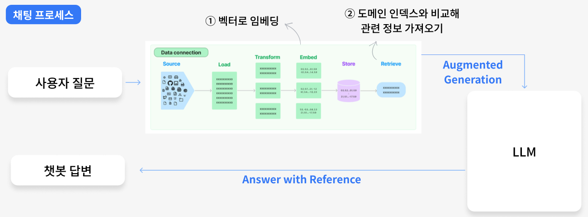
3. DPO(Direct Preference Optimization):
    - 보상 모델의 학습에 사용하는 선호도 데이터를 직접 학습에 사용‹
    - 두 모델 간의 대답 분포도 비교를 통해 유저가 원하는 대답으로
`Maximum likelihood 를 최적화`하는 방법
    - RLHF(Reinforcement Learning from Human Feedback)
      - 긍정/부정 혹은 순위 정보 형식의 사람의 피드백으로 보상을 계산하여 모델이 강화 학습하는 방법
      - 인적 자원 부족으로 미채택
<br>

#### 4. LLM 모델 평가
LLM 모델 평가를 통한 Base-model 선정 및 hyperparameter 탐색

1. Fine Tuning
    - Base Model 후보
      - Llama
        - Meta에서 만든 모델로 성능이 좋지만 한국어 데이터셋이 충분하지 않아 한국어 성능 부족
      - Polyglot-ko
        - EleutherAI에서 만든 모델로 한국어 데이터셋이 충분하여 한국어 성능 양호
      - KoAlpaca-Polyglot (★)
        - Polyglot-ko 모델로 한 번 더 한국어 데이터를 학습한 모델로 한국어 성능 매우 좋음
    - 모델 평가
    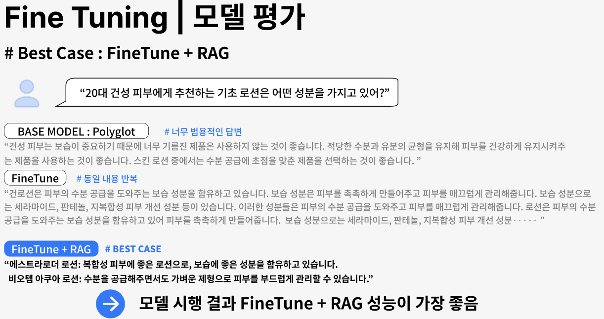
      - Best Case: Fine-tune + RAG
      - BaseModel: 범용적인 답변
      - Fine-tune: 동일 내용 반복
      - Fine-tune + RAG: 상품과 추천 이유를 적절히 답변

2. DPO
    - Base Model 후보
      - llama-2-koen-13b (★)
        - Llama 2를 한국어 어휘와 영어 말뭉치를 추가 학습
      - KoAlpaca-llama-2-7b
      - KoAlpaca-llama-1-7b (★)
        - Llama 2를 한국어 데이터와 KoAlpaca와 동일 방법으로 LoRA 파인 튜닝한 모델
      - TinyLlama-1.1B-Chat-v1.0
        - Llama 2의 매우 작은 버전
      - OPEN-SOLAR-KO-10.7B
        - upstage 의 SOLAR-10.7B-v1.0 모델 한국어 데이터셋을 학습
    - 모델 평가
    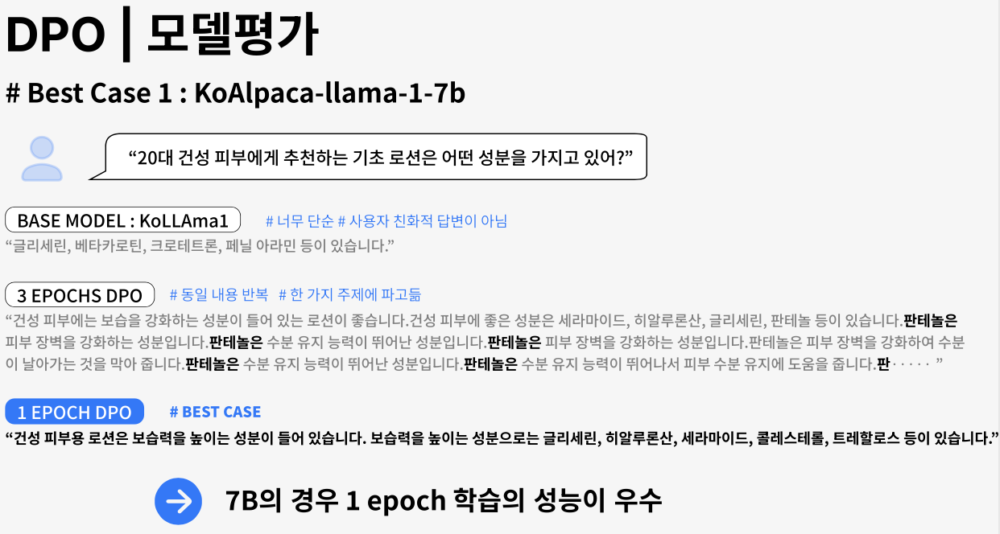
      - Best Case: 1 EPOCH DPO
      - BaseModel: 너무 단순하고 딱딱한 답변
      - 3 EPOCHS DPO: 동일 내용 반복하고 한 주제만 언급
      - 1 EPOCH DPO: 화장품 효능과 성분 종류 답변

<br>

#### 5. WEB UI(Streamlit)
Streamlit을 활용한 화장품 추천 및 챗봇과 설문조사 분석 대시보드, 성분알리미 등 WEB UI 구현


1. 메인 페이지: 
    - 기본정보 설문폼
    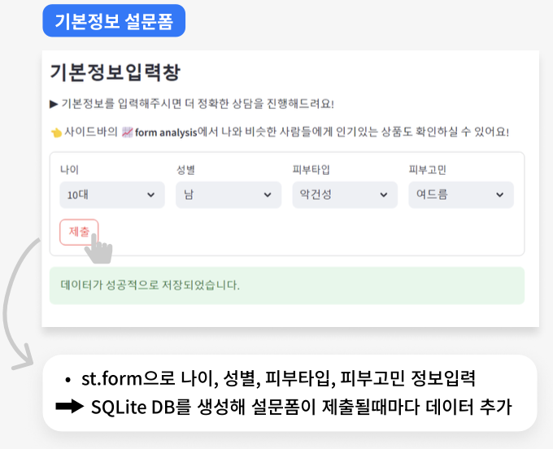
      - st.form: 나이, 성별, 피부타입, 피부고민 정보 입력 및 SQLite에 저장하여 분석에 사용
    - 추천 시스템: 제품 입력
    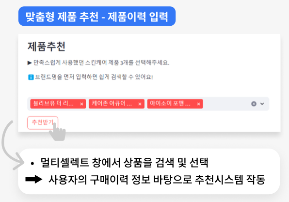
      - st.multiselect: 상품 검색 및 선택
      - 사용자의 구매 혹은 선호 제품을 바탕으로 추천시스템 작동
    - 추천 시스템: 제품 추천
    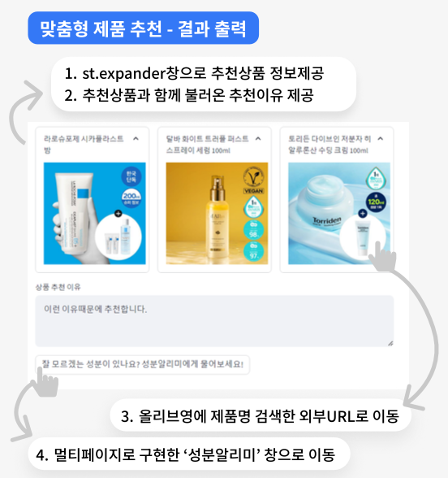
      - st.expander: 추천상품 정보 제공
      - 이미지 클릭: 외부URL로 이동
      - 상품 추천이유: 챗봇이 상품을 추천하는 이유 답변
      - 성분알리미 버튼 클릭: 성분알리미 페이지 이동
    - 챗봇 채팅창
    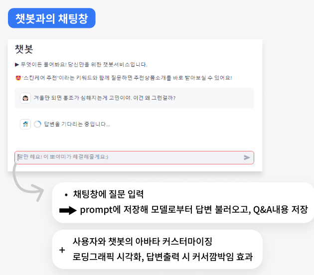
      - 네이버 지식IN 문답 데이터를 학습한 챗봇과 상담
2. 설문조사 분석 대시보드:
    - SQLite 데이터 시각화
    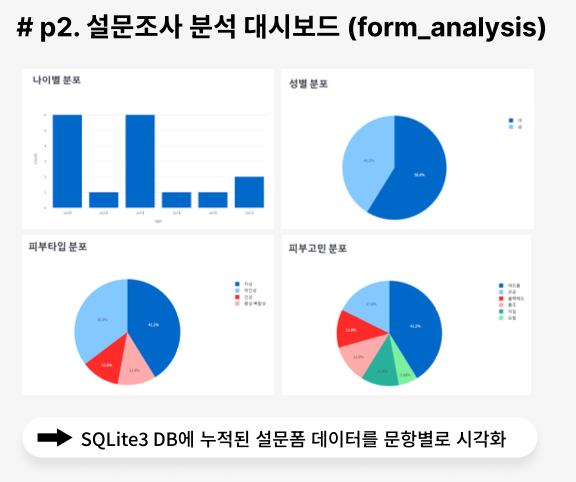
3. 성분알리미
    - 성분의 기원 및 정의, 배합목적, 특정 성분이 포함된 제품 검색
    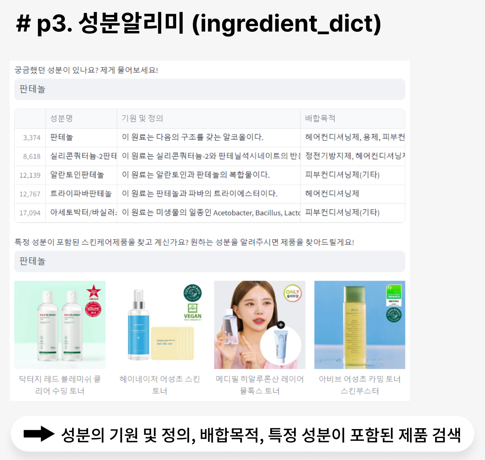

<br>

#### 6. 기대효과

화장품 추천 시스템과 챗봇 서비스 제공을 통해 아래와 같은 효과를 기대할 수 있습니다.

1. 고객 유인
    - 제품 추천과 맞춤 상담으로 사용자들을 회사의 제품 및 브랜드로 유인
2. 편리한 구매 경험
    - 이용자의 쇼핑 경험 개선 -> 시장 경쟁력 강화, 고객 유지로 판매 증진
3. 시장 트렌드 분석
    - 고객 구매 패턴, 선호도 분석 -> 시장 트렌드, 고객 선호도 파악, 신제품 개발 인사이트 획득
4. 고객 데이터 수집
    - 사용자의 선호도, 쇼핑 습관 등의 데이터 수집 가능 -> 타겟 마케팅 전략 수립 가능
5. 마케팅 효율성 증대
    - 시장 트렌드, 고객 데이터 -> 고객 프로파일링, 마케팅 전략 개발로 마케팅 효율성 증대
6. 재고 관리
    - 인기 제품, 고객 선호도 파악 -> 재고 관리의 효율성 증대

#### 7. 향후계획

프로젝트와 서비스 개선 방향과 향후계획입니다.

1. 학습 데이터 품질 향상
    - 서비스 목적에 적합한 형태의 다양한 데이터 셋으로 학습 필요
    - WizardLM의 Evol-Instruct 방법을 통해 특정 도메인의 데이터셋 생성
    - 데이터 전처리하여 부적절한 내용 학습 방지, 리뷰 및 제품 정보 추가 학습 필요
2. 모델 성능 개선
    - 고성능 GPU 환경에서 13B 이상의 finetuning + DPO + RAG을 연계, 답변의 Accuracy를 향상
    - Tokenizer 핸들링 및 Merge 기법 활용
3. 모델과 데이터 버전 관리
    - Huggingface를 활용한 모델과 데이터 버전 관리
4. 프롬프트 엔지니어링 개선
    - 명확한 지침을 작성하고 복잡한 작업을 간단한 하위 작업으로 분할
    - 토큰 사용을 최소화하기 위해 명확하고 간결한 지시 사항 제공
5. Intent Classification(의도 분류)
    - 추천 받기를 원하는 질문인지 판단하는 모델 구현 및 평가
    - 추후 부가적인 기능 확장에 이용
    - 자연어 처리 기반의 인터페이스에서 사용자의 의도를 정확하게 파악하여 해당 의도에 따른 적절한 응답이나 동작을 수행
6. 성능 평가
    - LLM judge 기반 평가
    - 평가 데이터 세트 생성 (question, context)
    - 다양한 언어 모델을 활용하여 답안지 생성 (answer)
    - 성적 생성
      - 재현성을 보장하기 위해 낮은 temperature 설정
      - LLM이 채점 과정에 대한 추론할 수 있도록 Chain of thought 프롬프트 생성
      - 각 요서(정확성, 이해도, 가독성)의 각 점수 값에 대한 채점 기준에 몇가지 예시가 제공되는 Few-shot 생성


<br><br>


## 🍉 기술 스택


<br>


## 👶 팀원 소개

<table border="" cellspacing="0" cellpadding="0" max-width="2000px">
    <tr width="100%">
        <td align="center"><a href= "https://github.com/zave7">권영찬</a></td>
        <td align="center"><a href= "https://github.com/ooooasisss">김가영</a></td>
        <td align="center"><a href= "https://github.com/statezeropy">김주영</a></td>
        <td align="center"><a href= "https://github.com/strlla4536">김혜규</a></td>
        <td align="center"><a href= "https://github.com/seyeon-shijuan">박세연</a></td>
        <td align="center"><a href= "https://github.com/Minnie02">전민지</a></td>
        <td align="center"><a href= "https://github.com/StandingR">정재우</a></td>
    </tr>
    <tr width="100%">
        <td align="center">
          <a href= "https://github.com/zave7">
            
          </a>
        </td>
        <td align="center">
          <a href= "https://github.com/ooooasisss">
            
          </a>
        </td>
        <td align="center">
          <a href= "https://github.com/KimJuyoung23">
            
          </a>
        </td>
        <td align="center">
          <a href= "https://github.com/strlla4536">
            
          </a>
        </td>
        <td align="center">
          <a href= "https://github.com/seyeon-shijuan">
            
          </a>
        </td>
        <td align="center">
          <a href= "https://github.com/Minnie02">
            
          </a>
        </td>
        <td align="center">
          <a href= "https://github.com/StandingR">
            
          </a>
        </td>
    </tr>
    <tr width="100%">
      <td align="center">
        <small>
        LLM 학습 데이터 수집<br>
        API 개발
        </small>
      </td>
      <td align="center">
        <small>
        WEB UI<br>
        Streamlit
        </small>
      </td>
      <td align="center">
        <small>
        Fine-tuning<br>
        LLMChain
        </small>
      </td>
      <td align="center">
        <small>
        LangChain Retrieval<br>
        ChromaDB
        </small>
      </td>
      <td align="center">
        <small>
        LLM DPO<br>
        추천 알고리즘
        </small>
      </td>
      <td align="center">
        <small>
        추천 시스템<br>
        협업 필터링
        </small>
      </td>
      <td align="center">
        <small>
        화장품 데이터 수집<br>
        데이터 EDA
        </small>
      </td>
   </tr>
</table>

<br>
<br>

## 💀 스켈레톤
- app: 챗봇, 웹, 추천시스템 3개의 APP으로 구분하여 API통신 시스템 구축
- dataloader: LLM 학습용 데이터, 화장품 데이터 수집과 RAG시스템을 위한 ChromaDB 적제
```
src/
├── app/
│   ├── chatbot/            # 챗봇 LLM 서비스
│   │   └── src/
│   │       ├── api/        # LLM Inference API
│   │       └── model/
│   │           └── llm/    # LLM model
│   ├── front/              # WEB UI 서비스 - Streamlit
│   │   └── src/
│   │       ├── api/
│   │       └── pages/
│   └── recommend/          # 추천시스템 API
│   │   └── src/
│   │       └── api/
└── dataloader/             # 화장품 데이터 수집
    ├── fine-tuning         # LLM 학습용 데이터 수집
    └── rag                 # ChromaDB 데이터 적제

```